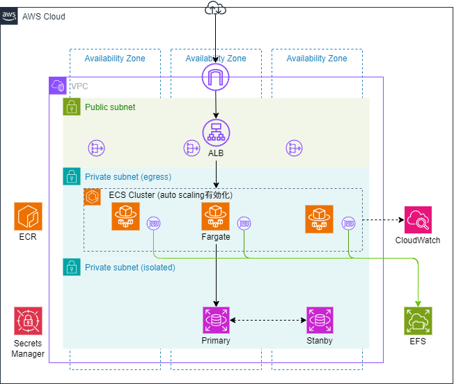

# 実行基盤の設計

## 要件

- スレートレスなWebアプリケーション実行環境 (今回はWordPressを動作させる)
- データベースはRDSを利用

## 構成図

構築の際はコスト面を考慮して、以下の構成とする

- NAT Gatewayは1台で構築する
- RDSはシングルインスタンスで構築する
- FargateやRDSインスタンスは、最小スペックとする

## 構成要素

本構成図は、Security GroupやRoute Tableなどの詳細な設定は省略している
主要な構成要素は以下の通り、

- VPC内
  - パブリックサブネット
    - ALB
    - NAT Gateway
  - プライベートサブネット(egress)
    - ECS on Fargate
    - マウントポイント for EFS
  - プライベートサブネット(isolated)
    - RDS for MySQL
- VPC外
  - ECR
  - EFS
  - CloudWatch
  - Secrets Manager

---

## ECS on Fargateの選定理由

### 主な特徴

- AWSに特化したコンテナオーケストレーションサービスで実行環境にFargateを使用することでインフラの管理が不要になる

### Pros

1. インフラ管理コストの削減
   - Fargateをコンテナ実行環境に用いることでOSレイヤの管理が不要
   - クラスター管理が比較的容易
2. スケーラビリティ
   - オートスケーリングによる水平スケーリングが可能
   - CPUやメモリの使用率などを監視し、負荷に応じたリソースのプロビジョニングが可能
3. コスト効率
   - 負荷に応じてリソースをプロビジョニングするため高いコスト効率を実現
   - コントロールプレーンの利用料金が不要

### Cons

1. カスタマイズに制限
   - OSレベルの最適化が不可
   - GPUを使う場合は対応不可
2. 継続的なサーバコスト
   - 管理コストは軽減される反面、インスタンスコストは高くなる
3. マルチクラウド対応
   - AWSにベンダーロックインしてしまうリスク

### 他の選択肢との比較

- 前提
  - 本番での運用を想定して高可用かつスケーラビリティを確保する
  - 継続的デリバリ―の実践や水平スケーリング、運用管理の観点でコンテナ化は必須とする
  - Lambdaは実行時間に制限があり、WordPressのような常時起動タイプのサービスと相性が悪いので除外する
- 比較対象
  - ECS on EC2
    - コンテナ実行環境としての柔軟性は高いが、サーバレスによるサーバ管理の軽減等のメリットが得られない
    - 今回はアプリケーションの特殊な要件やハードウェア要件がないため、Fargateにすることで得られるメリットが大きい
  - EKS on Fargate
    - EKSはECSに比べ高機能でエコシステムが広いが、クラスター管理やコスト面でECSにメリットがある
    - WordPressサーバを稼働させるだけならEKSを採用するメリットが薄い
    - 設定がECSより複雑で自身に知見がないため、構築に時間がかかる
  - App Runner
    - 本番環境での採用実績が少ない
    - 抽象化された設定で構築速度は早いが、拡張性はECSに比べ乏しい
    - ネイティブ機能でFluentBitが使えない
