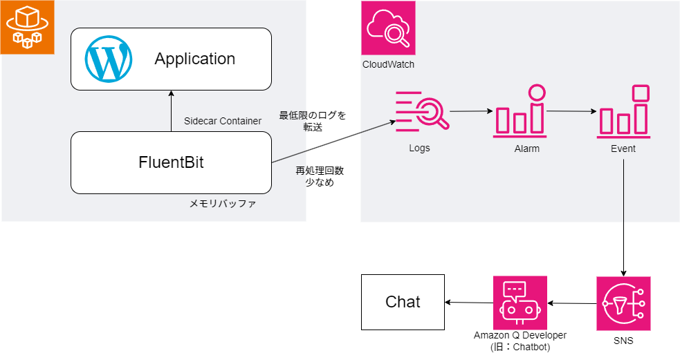
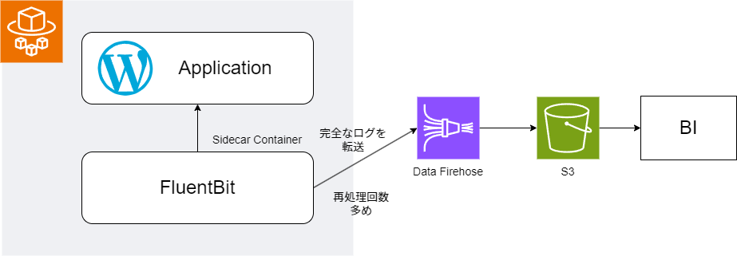

# ログ転送の設計

## 1. リアルタイム性を重視した構成（アラート/異常検知用途）

### 概要

- 低レイテンシで最低限のログを転送し、リアルタイムでのアラートや異常検知に活用できるような設計
- 転送の途中でログの欠落が発生しても、リアルタイム性を優先する

### 構成

- ログの収集
  - サイドカーコンテナとしてFluentBitを用意し、標準出力やログファイルからログを収集する
- バッファリング
  - 高スループットなメモリバッファを用いる
  - バッファ時間は最低限とする
  - 再処理回数は最低限とする
- フィルタリング
  - アラートや異常検知に用いるログのみを転送するようにフィルタリングを行う
- CloudWatch Logsに転送
  - FluentBitの再処理回数は最低限とする
- アラート・異常検知
  - CloudWatch AlarmやEventを用いて通知先にアラートを必要に応じて通知する

## 2. 完全性を重視した構成 (BI連携/データ解析用途)

### 概要

- ログの完全性を優先し、全ログデータの保存と転送する設計
- 転送の再処理機構を用意し、at-least-onceを実現する

### 構成

- ログの収集
  - サイドカーコンテナとしてFluentBitを用意し、標準出力やログファイルからログを収集する
- バッファリング
  - FluentBitからData Firehoseに転送するまでの間、メモリバッファを用いる
  - Data Firehoseのバッファリングを用いる
- フィルタリング
  - フィルタリングは行わない、全てのログを転送する
- S3バケットに転送
  - FluentBitで全データをData Firehoseに転送する
  - Data Firehoseでデータの圧縮などの加工を行い、転送を行う
  - S3バケットへの転送にはDataFirehoseの再処理を実施する
- BI連携やデータ分析
  - S3に保存したログを必要に応じてETLなどを行い、分析系サービスに連携する
  